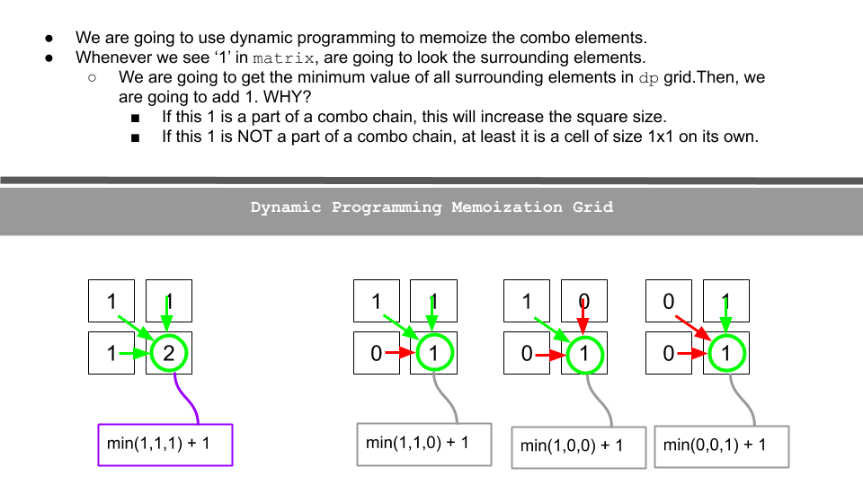
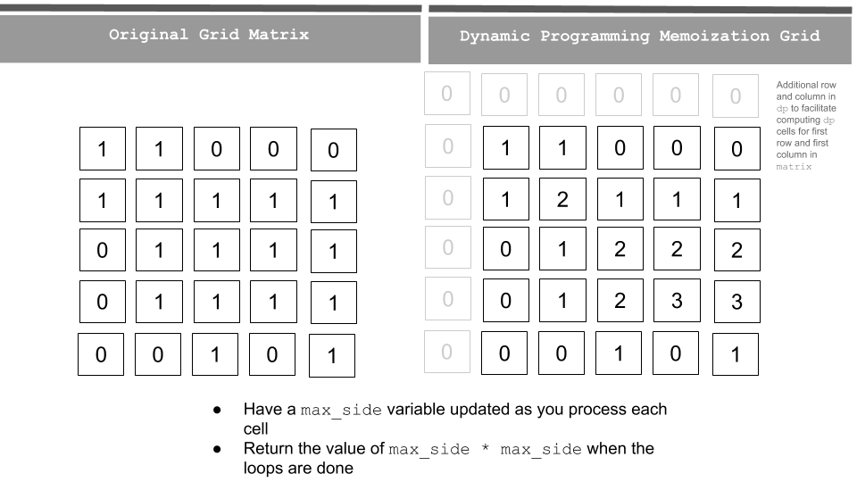

# 2D Range Sum
## Problem 
[leetcode 212 Maximal Square](https://leetcode.com/problems/maximal-square/)

## Solution 
### Naive 2D DP precaculation solution (4148 ms)

~~~ python
"""
runtime: 4148 ms
Time complexity: O(n^3)
Space complexity: O(n^2)
"""
class Solution:
    def maximalSquare(self, matrix: List[List[str]]) -> int:
        if not matrix or not matrix[0]:return 0
        R, C = len(matrix), len(matrix[0])
        dp = [[0]*(C+1) for _ in range(R+1)]
        for i in range(R):
            for j in range(C):
                dp[i+1][j+1] = dp[i][j+1]+dp[i+1][j]-dp[i][j]+int(matrix[i][j])
        res = 0
        for i in range(R):
            for j in range(C):
                for k in range(i, R):
                    d = k - i
                    new_j = j + d
                    if new_j<C:
                        if (d+1)**2>res and dp[k+1][new_j+1]-dp[k+1][j]-dp[i][new_j+1]+dp[i][j]==(d+1)**2:
                            res = (d+1)**2
        return res

~~~

### A better one
A better one can be found [here](https://leetcode.com/problems/maximal-square/discuss/600149/Python-Thinking-Process-Diagrams-DP-Approach).  Below two images are from [here](https://leetcode.com/problems/maximal-square/discuss/600149/Python-Thinking-Process-Diagrams-DP-Approach).  



After you read the original post, and the code should be straightforward.

```python


```
